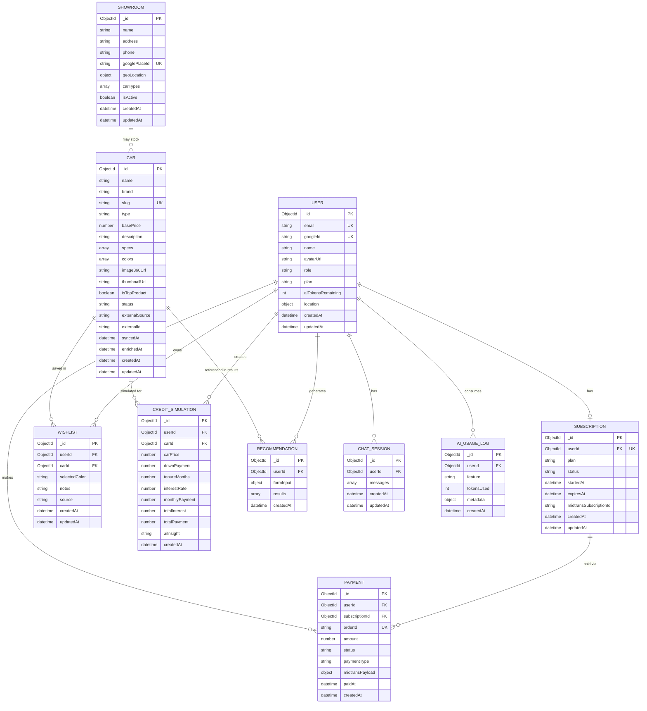
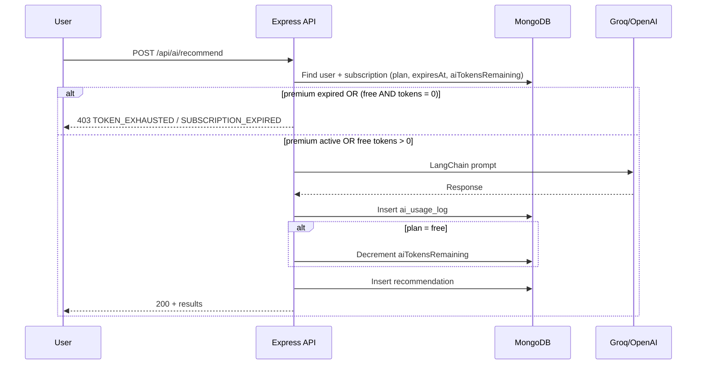

# Entity Relationship Diagram (ERD)
## Car Showroom AI — MVP Lite

| Field | Value |
|-------|-------|
| **Database** | MongoDB (NoSQL) |
| **ORM** | Mongoloquent |
| **Versi** | 1.2 (MVP Lite + CarAPI) |

---

## 1. Diagram Overview



---

## 2. Relasi Antar Entitas

| Relasi | Kardinalitas | Keterangan |
|--------|--------------|------------|
| User → Wishlist | 1 : N | Satu user banyak item wishlist |
| User → Subscription | 1 : 1 | Satu user satu record subscription aktif |
| User → Payment | 1 : N | Riwayat pembayaran Midtrans |
| User → ChatSession | 1 : N | Riwayat sesi chatbot |
| User → CreditSimulation | 1 : N | Histori simulasi kredit |
| User → AiUsageLog | 1 : N | Audit penggunaan token AI |
| User → Recommendation | 1 : N | Histori hasil AI rekomendasi (`userId` FK; nullable untuk guest trial) |
| Car → Wishlist | 1 : N | Mobil bisa disimpan banyak user |
| Car → Recommendation | 1 : N | Mobil direferensikan di `results[].carId` (embedded, bukan FK root) |
| Subscription → Payment | 1 : N | Riwayat pembayaran monthly; setiap bayar = +30 hari premium |
| Showroom ↔ Car | N : M | Showroom seed: `carTypes` / `carIds` (logis) |


### Relasi Alur Bisnis (bukan FK langsung)

| Alur | Keterangan |
|------|------------|
| CarAPI.app → cars | Sync job fetch trims/specs → upsert by `slug`; merge enrichment JSON |
| Recommendation → Wishlist | `wishlists.source = 'recommendation'` |
| User location → Showroom | GPS → nearby 1x/session → Places Opsi A atau seed |
| Recommendation → Showroom | CTA baca frontend session state |
| Recommendation ↔ AiUsageLog | Satu AI recommend → log + recommendation doc |

---

## 3. Schema Detail (Mongoloquent Models)

### 3.1 `users`

```javascript
{
  _id: ObjectId,
  email: String,           // required, unique, indexed
  googleId: String,        // unique, required for MVP Lite
  name: String,
  avatarUrl: String,
  role: {
    type: String,
    enum: ['buyer'],         // MVP Lite: buyer only
    default: 'buyer'
  },
  plan: {
    type: String,
    enum: ['free', 'premium'],
    default: 'free'
  },
  aiTokensRemaining: {
    type: Number,
    default: 5               // free tier starting quota
  },
  location: {
    lat: Number,
    lng: Number,
    address: String,
    updatedAt: Date
  },
  createdAt: Date,
  updatedAt: Date
}

// Indexes
// { email: 1 } unique
// { googleId: 1 } unique, sparse
```

---

### 3.2 `cars` (CarAPI sync + enrichment)

Populated by sync job (`npm run sync:cars`), **not** manual seed or user-facing write API.

```javascript
{
  _id: ObjectId,
  name: String,              // mapped from CarAPI model + trim
  brand: String,             // CarAPI make
  slug: String,              // unique, URL-friendly (upsert key)
  type: String,              // SUV | MPV | Sedan | Hatchback | Pickup (mapped from body)
  basePrice: Number,         // IDR — from enrichment ONLY (not CarAPI MSRP)
  description: String,
  specs: {
    engine: String,
    transmission: String,
    fuelType: String,
    seats: Number,
    mileage: String
  },
  colors: [                  // from enrichment ONLY
    {
      name: String,
      hexCode: String,
      imageUrl: String,
      availability: {
        type: String,
        enum: ['available', 'limited', 'out_of_stock'],
        default: 'available'
      }
    }
  ],
  image360Url: String,       // enrichment (Top Product)
  thumbnailUrl: String,      // enrichment
  isTopProduct: {
    type: Boolean,
    default: false           // exactly ONE true via enrichment
  },
  status: {
    type: String,
    enum: ['active', 'inactive'],
    default: 'active'
  },
  externalSource: {
    type: String,
    enum: ['carapi'],
    default: 'carapi'
  },
  externalId: String,        // CarAPI trim/id for re-sync
  syncedAt: Date,            // last CarAPI fetch
  enrichedAt: Date,            // last enrichment merge
  createdAt: Date,
  updatedAt: Date
}

// Upsert key: { slug: 1 } unique
// Sync: CarAPI → map → merge config/car-enrichment.json → upsert
// User API: GET only

// Indexes
// { slug: 1 } unique
// { isTopProduct: 1, status: 1 }
// { brand: 1, type: 1 }
// { basePrice: 1 }
```

---

### 3.3 `wishlists`

```javascript
{
  _id: ObjectId,
  userId: ObjectId,          // ref: users, required, indexed
  carId: ObjectId,           // ref: cars, required
  selectedColor: String,     // color name from car.colors[]
  notes: String,
  source: {
    type: String,
    enum: ['recommendation', 'detail_page', 'manual'],
    default: 'detail_page'
  },
  createdAt: Date,
  updatedAt: Date
}

// Indexes
// { userId: 1, carId: 1 } unique compound (prevent duplicate)
// { userId: 1, createdAt: -1 }
```

---

### 3.4 `subscriptions`

```javascript
{
  _id: ObjectId,
  userId: ObjectId,          // ref: users, unique (1:1)
  plan: {
    type: String,
    enum: ['free', 'premium'],
    default: 'free'
  },
  status: {
    type: String,
    enum: ['active', 'expired', 'cancelled', 'pending'],
    default: 'active'
  },
  startedAt: Date,
  expiresAt: Date,           // null for free; startedAt + 30 days for premium_monthly
  midtransSubscriptionId: String,
  createdAt: Date,
  updatedAt: Date
}

// Indexes
// { userId: 1 } unique
// { status: 1, expiresAt: 1 }
```

---

### 3.5 `payments`

```javascript
{
  _id: ObjectId,
  userId: ObjectId,          // ref: users
  subscriptionId: ObjectId,  // ref: subscriptions
  orderId: String,           // Midtrans order_id, unique
  amount: Number,
  status: {
    type: String,
    enum: ['pending', 'success', 'failed', 'expired', 'refunded'],
    default: 'pending'
  },
  paymentType: String,       // MVP: "premium_monthly" only (30 hari)
  midtransPayload: Object,   // full webhook/callback body
  paidAt: Date,
  createdAt: Date
}

// Indexes
// { orderId: 1 } unique
// { userId: 1, createdAt: -1 }
```

---

### 3.6 `showrooms` (seed fallback + Places Opsi A)

Data seed dipakai saat Google Places gagal/kosong. Response Places **tidak** disimpan ke MongoDB.

```javascript
{
  _id: ObjectId,
  name: String,
  address: String,
  phone: String,
  googlePlaceId: String,     // optional on seed records
  geoLocation: {
    type: {
      type: String,
      enum: ['Point'],
      default: 'Point'
    },
    coordinates: [Number]      // [longitude, latitude]
  },
  carTypes: [String],          // ["MPV", "SUV"]
  carIds: [ObjectId],          // optional: ref cars in seed
  isActive: {
    type: Boolean,
    default: true
  },
  createdAt: Date,
  updatedAt: Date
}

// MVP Lite: min 3 seed records (Jakarta area) for $near fallback
// Primary source at runtime: Google Places API (not persisted)
// Backend: GET /showrooms/nearby → Places first, else seed $near

// Indexes
// { geoLocation: '2dsphere' }  — geospatial queries
// { googlePlaceId: 1 } unique, sparse
```

---

### 3.7 `chat_sessions`

```javascript
{
  _id: ObjectId,
  userId: ObjectId,          // ref: users
  messages: [
    {
      role: {
        type: String,
        enum: ['user', 'assistant', 'system']
      },
      content: String,
      timestamp: Date
    }
  ],
  createdAt: Date,
  updatedAt: Date
}

// Indexes
// { userId: 1, updatedAt: -1 }
```

---

### 3.8 `credit_simulations`

```javascript
{
  _id: ObjectId,
  userId: ObjectId,          // ref: users (nullable for guest — MVP: require login)
  carId: ObjectId,           // ref: cars, optional
  carPrice: Number,
  downPayment: Number,
  tenureMonths: Number,      // 12, 24, 36, 48, 60
  interestRate: Number,      // annual % e.g. 5.5
  monthlyPayment: Number,    // calculated
  totalInterest: Number,
  totalPayment: Number,
  aiInsight: String,         // AI-generated summary
  createdAt: Date
}

// Indexes
// { userId: 1, createdAt: -1 }
```

---

### 3.9 `ai_usage_logs`

```javascript
{
  _id: ObjectId,
  userId: ObjectId,          // ref: users
  feature: {
    type: String,
    enum: ['recommendation', 'chatbot', 'credit_simulation']
  },
  tokensUsed: {
    type: Number,
    default: 1
  },
  metadata: {
    carId: ObjectId,
    sessionId: ObjectId,
    promptTokens: Number,
    completionTokens: Number
  },
  createdAt: Date
}

// Indexes
// { userId: 1, createdAt: -1 }
// { userId: 1, feature: 1 }
```

---

### 3.10 `recommendations`

Menyimpan input form dan output AI dari endpoint `POST /api/ai/recommend` (PRD §6.1 HP-03, HP-04).

```javascript
{
  _id: ObjectId,
  userId: ObjectId,          // ref: users, nullable for guest trial
  formInput: {
    budgetMin: Number,
    budgetMax: Number,
    carType: String,
    passengers: Number,
    priority: String,
    preferredColor: String
  },
  results: [
    {
      carId: ObjectId,       // ref: cars (embedded, bukan FK root)
      carName: String,
      matchScore: Number,    // 0-100
      suggestedColors: [String],
      reason: String         // AI explanation
    }
  ],
  createdAt: Date
}

// Indexes
// { userId: 1, createdAt: -1 }

// Relasi
// users        ← userId (1:N)
// cars         ← results[].carId (1:N, embedded)
// ai_usage_logs ← dibuat bersamaan saat AI recommend (proses, bukan FK)
// wishlists    ← user bisa simpan mobil dari results via UI (source: 'recommendation')
```

---

## 4. Diagram Embedded vs Referenced

```
┌─────────────────────────────────────────────────────────────┐
│                        cars                                  │
│  Source: CarAPI.app sync + car-enrichment.json merge        │
│  ┌─────────────────────────────────────────────────────┐    │
│  │ colors[] (EMBEDDED — from enrichment)               │    │
│  │ specs (EMBEDDED — mapped from CarAPI)               │    │
│  │ externalSource, externalId, syncedAt, enrichedAt    │    │
│  └─────────────────────────────────────────────────────┘    │
└─────────────────────────────────────────────────────────────┘

┌──────────────┐         ObjectId ref         ┌──────────────┐
│   wishlists  │ ──────── userId ───────────► │    users     │
│              │ ──────── carId ────────────► │              │
└──────────────┘                              └──────────────┘

┌──────────────┐         ObjectId ref         ┌──────────────┐
│chat_sessions │ ──────── userId ───────────► │    users     │
│  messages[]  │ (EMBEDDED array)             │              │
└──────────────┘                              └──────────────┘

┌────────────────┐       userId (FK)          ┌──────────────┐
│ recommendations│ ───────────────────────────► │    users     │
│  formInput     │                              │              │
│  results[]     │ ── results[].carId ────────► │    cars      │
│    └── carId   │ (EMBEDDED ref)               │              │
└────────────────┘                              └──────────────┘
        │
        │ alur bisnis (bukan FK)
        ▼
┌──────────────┐
│  wishlists   │  source: 'recommendation'
└──────────────┘
```

**Keputusan desain:**
- **CarAPI + enrichment** — specs otomatis; harga IDR, warna, CI360 dari `config/car-enrichment.json`
- **Colors embedded di `cars`** — swap image by color name on detail page
- **Messages embedded di `chat_sessions`**
- **Results embedded di `recommendations`**
- **Subscription terpisah dari User** — Midtrans webhook sync
- **Showroom seed** — fallback Places Opsi A; frontend fetch 1x/session

---

## 4.1 Car Sync (CarAPI.app + Enrichment)

```
[CarAPI.app] ──JWT/server-side──► [Sync Service]
                                      │
[config/car-enrichment.json] ──merge──┤
                                      ▼
                               upsert by slug
                                      │
                                      ▼
                               [(MongoDB cars)]

[Frontend] ──GET /api/cars──► MongoDB (read-only)
```

| Sumber | Field contoh | Persisted? |
|--------|--------------|------------|
| CarAPI | brand, name, specs, description, externalId | Ya |
| Enrichment | basePrice (IDR), colors[], image360Url, isTopProduct | Ya (override) |
| CarAPI MSRP USD | — | **Tidak dipakai** langsung |

**Enrichment example (`config/car-enrichment.json`):**

```json
{
  "toyota-camry-xle": {
    "basePrice": 450000000,
    "isTopProduct": true,
    "image360Url": "https://cdn.example.com/360/camry/",
    "thumbnailUrl": "https://cdn.example.com/camry/thumb.jpg",
    "colors": [
      { "name": "Pearl White", "hexCode": "#F5F5F5", "imageUrl": ".../white.jpg", "availability": "available" }
    ]
  }
}
```

---

## 4.2 Showroom Resolution (Opsi A + Session)

```
[Frontend — 1x per session]
  App init → GPS → GET /api/showrooms/nearby?lat=&lng=
  → store in React Context + sessionStorage

[Backend — Opsi A]
  1. googlePlacesNearby(lat, lng)
  2. if OK && results.length → { source: "google_places", data }
  3. else → Showroom.find({ geoLocation: { $near: ... } })
           → { source: "seed", data }

[Subsequent UI]
  Homepage / Detail / Rekomendasi CTA → read session state (no API)
```

| `source` | Asal data | Persisted? |
|----------|-----------|------------|
| `google_places` | Google Places API | Tidak (live response) |
| `seed` | Collection `showrooms` | Ya (seed data) |

---

## 4.3 Subscription Lifecycle (Premium Monthly)

```
FREE (5 tokens)
    │
    ▼ token habis / user upgrade
MIDTRANS PAY (premium_monthly)
    │
    ▼ webhook success
PREMIUM ACTIVE ── expiresAt = startedAt + 30 hari ── AI unlimited
    │
    ▼ expiresAt < now (cron/job)
EXPIRED ── plan=free, status=expired, aiTokensRemaining=0 ── AI BLOCKED
    │
    ▼ user bayar lagi via Midtrans
PREMIUM ACTIVE (+30 hari baru dari tanggal bayar)
```

| Status | `users.plan` | `subscriptions.status` | Akses AI |
|--------|--------------|------------------------|----------|
| Free (quota ada) | `free` | `active` | Ya, max 5x total |
| Free (quota habis) | `free` | `active` | **Blocked** → prompt upgrade |
| Premium aktif | `premium` | `active` | Unlimited |
| Premium expired | `free` | `expired` | **Blocked** → prompt re-subscribe |

---

## 5. Business Rules (Database Level)

| Rule | Implementasi |
|------|--------------|
| Car sync upsert | Upsert `cars` by `{ slug }`; set `syncedAt`, `externalSource: 'carapi'` |
| Enrichment merge | After CarAPI map, merge `car-enrichment.json` by slug; set `enrichedAt` |
| Harga IDR | `basePrice` **only** from enrichment — never raw CarAPI MSRP |
| Hanya 1 Top Product | Enrichment: exactly one `isTopProduct: true` |
| User cars API | GET only — no POST/PUT/DELETE for buyers |
| Showroom Opsi A | Places first; fallback seed `$near`; return `source` |
| Showroom 1x/session | Frontend Context + sessionStorage |
| Premium aktif | `plan=premium` AND `status=active` AND `expiresAt > now()` |
| AI token tidak negatif | Pre-hook AI: premium aktif OR `aiTokensRemaining > 0` |
| Premium unlimited | Skip decrement jika premium **aktif** (cek `expiresAt`) |
| Premium expired | Cron/job: set `plan=free`, `status=expired`, `aiTokensRemaining=0`; blok AI |
| Re-subscribe | Webhook Midtrans baru → `startedAt=now`, `expiresAt=now+30d`, `status=active`, `plan=premium` |
| Free tier default | On user create: `aiTokensRemaining=5`, `plan='free'` |
| Premium monthly only | `paymentType` enum MVP: `['premium_monthly']`; durasi = 30 hari |
| Geo nearest showroom | `$near` on `showrooms.geoLocation` (fallback path only) |
| Wishlist no duplicate | Compound unique index `{ userId, carId }` |

---

## 6. Token Consumption Flow



---

## 7. Initial Data (MVP)

| Collection | Min Records | Sumber |
|------------|-------------|--------|
| users | 2+ | Google OAuth test accounts |
| cars | 5–10 | **CarAPI sync** + enrichment |
| showrooms | 3+ | **Seed script** (Jakarta fallback) |
| subscriptions | 1+ | Test buyer free tier |
| recommendations | 3+ | Sample AI output (optional) |

**Contoh enrichment entry** (bukan full car doc — specs dari CarAPI):

```json
{
  "honda-cr-v-ex-l": {
    "basePrice": 520000000,
    "isTopProduct": true,
    "image360Url": "https://cdn.example.com/360/crv/",
    "thumbnailUrl": "https://cdn.example.com/crv/thumb.jpg",
    "colors": [
      { "name": "Platinum White", "hexCode": "#F5F5F5", "imageUrl": ".../white.jpg", "availability": "available" },
      { "name": "Crystal Black", "hexCode": "#1A1A1A", "imageUrl": ".../black.jpg", "availability": "available" }
    ]
  }
}
```

---

## 8. Zod Validation Schemas (Request ↔ Model Mapping)

| Endpoint | Zod Schema Fields |
|----------|-------------------|
| POST `/api/wishlist` | carId, selectedColor?, notes?, source? |
| POST `/api/ai/recommend` | budgetMin, budgetMax, carType, passengers, priority |
| POST `/api/ai/chat` | sessionId?, message |
| POST `/api/ai/credit-simulate` | carPrice, downPayment, tenureMonths, interestRate, carId? |
| POST `/api/subscription/checkout` | paymentType (`premium_monthly`) |
| POST `/api/internal/sync/cars` | (dev-only) header `X-Sync-Secret` |

---

## 9. Collections Summary

| Collection | Est. Docs (MVP) | Growth |
|------------|-----------------|--------|
| users | 100 | Linear |
| cars | 5–10 | Sync refresh (not user growth) |
| showrooms | 3–5 | Fixed (seed) |
| wishlists | 500 | Linear |
| subscriptions | = users | 1:1 |
| payments | 50 | With conversions |
| chat_sessions | 200 | Per user |
| credit_simulations | 300 | Per user |
| ai_usage_logs | 1000 | High |
| recommendations | 500 | Per AI call |

---

## 10. Future Extensions (Post-MVP)

- **`places_cache`** — cache Google Places
- **Admin panel** — CRUD mobil/showroom UI
- **API katalog Indonesia** — Carapis, dealer API (harga OTR IDR native)
- **Paid CarAPI tier** — dataset lengkap 2020+ untuk production
- Collection `notifications`
- Collection `car_comparisons`
- Sharding `ai_usage_logs` by month
