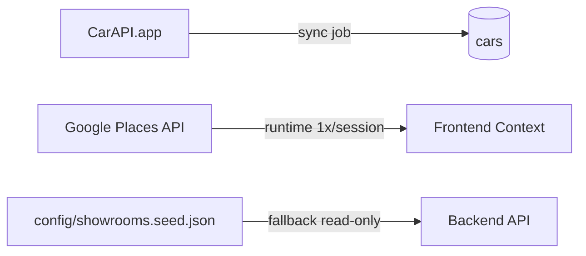

# Entity Relationship Diagram (ERD)
## RAC (Recommendation Auto Car) AI — MVP Lite

| Field | Value |
|-------|-------|
| **Versi** | 1.3 |
| **Database** | MongoDB |
| **ORM** | Mongoloquent |
| **Collections** | 5 |

---

## 1. Ringkasan

ERD MVP Lite: **5 koleksi MongoDB** untuk data yang perlu persist.

| # | Collection | Tujuan |
|---|------------|--------|
| 1 | `users` | Profil buyer (Google OAuth) + kuota AI free tier |
| 2 | `cars` | Katalog mobil (CarAPI sync + enrichment manual) |
| 3 | `wishlists` | Mobil tersimpan user (+ metadata dari rekomendasi AI) |
| 4 | `subscriptions` | Langganan premium **+ riwayat pembayaran Midtrans** (digabung) |
| 5 | `ai_usage_logs` | Audit trail konsumsi token AI |

**Tidak disimpan di MongoDB:**

| Fitur | Alasan |
|-------|--------|
| Rekomendasi AI | Hasil langsung ke UI; user simpan ke `wishlists` |
| Chatbot sesi | Stateless per request; tidak perlu `chat_sessions` |
| Simulasi kredit | Perhitungan real-time; tidak perlu `credit_simulations` |
| Showroom | Google Places **runtime only** (1x/session frontend); fallback dari `config/showrooms.seed.json` (bukan collection) |
| `places_cache` | Dihapus — fetch 1x/session di frontend |

---

## 2. Diagram Relasi (Mermaid)

```mermaid
erDiagram
    USERS ||--o{ WISHLISTS : owns
    USERS ||--o| SUBSCRIPTIONS : has
    USERS ||--o{ AI_USAGE_LOGS : consumes
    CARS ||--o{ WISHLISTS : "saved in"

    USERS {
        ObjectId _id PK
        string email UK
        string googleId UK
        string name
        string avatarUrl
        string role
        number aiTokensRemaining
        object location
        date createdAt
        date updatedAt
    }

    CARS {
        ObjectId _id PK
        string name
        string brand
        string slug UK
        string type
        number basePrice
        string description
        object specs
        array colors
        string image360Url
        string thumbnailUrl
        boolean isTopProduct
        string status
        string externalSource
        string externalId
        date syncedAt
        date enrichedAt
        date createdAt
        date updatedAt
    }

    WISHLISTS {
        ObjectId _id PK
        ObjectId userId FK
        ObjectId carId FK
        string selectedColor
        string notes
        string source
        number matchScore
        string aiReason
        date createdAt
        date updatedAt
    }

    SUBSCRIPTIONS {
        ObjectId _id PK
        ObjectId userId FK_UK
        date expiresAt
        date startedAt
        string orderId UK
        number amount
        string paymentStatus
        string paymentType
        object midtransPayload
        date paidAt
        date createdAt
        date updatedAt
    }

    AI_USAGE_LOGS {
        ObjectId _id PK
        ObjectId userId FK
        string feature
        number tokensUsed
        object metadata
        date createdAt
    }
```

**External (bukan collection):**



---

## 3. Aturan Akses Premium

Status langganan **tidak** memakai kolom `plan` / `status` terpisah. Cukup **`subscriptions.expiresAt`**:

| Kondisi | Akses AI |
|---------|----------|
| `expiresAt > now()` | Unlimited (premium aktif) |
| Tidak ada record / `expiresAt <= now()` | Free tier — pakai `users.aiTokensRemaining` |
| Free tier token = 0 | AI diblok → prompt upgrade |

**Cron expiry:** jika `expiresAt <= now()` → set `users.aiTokensRemaining = 0` (AI blocked).

---

## 4. Schema Detail

### 4.1 users

```javascript
{
  _id: ObjectId,
  email: String,           // unique, required
  googleId: String,        // unique, required
  name: String,
  avatarUrl: String,
  role: { type: String, default: "buyer", enum: ["buyer"] },
  aiTokensRemaining: { type: Number, default: 5 },
  location: {
    lat: Number,
    lng: Number,
    address: String
  },
  createdAt: Date,
  updatedAt: Date
}
```

**Indexes:** `{ email: 1 }` unique, `{ googleId: 1 }` unique

---

### 4.2 cars

Katalog dari **CarAPI.app sync** + override **`config/car-enrichment.json`**.

```javascript
{
  _id: ObjectId,
  name: String,            // e.g. "Toyota Camry XLE"
  brand: String,
  slug: String,            // unique, URL-friendly
  type: String,            // SUV | MPV | Sedan | Hatchback | ...
  basePrice: Number,       // IDR — dari enrichment
  description: String,
  specs: {
    engine: String,
    transmission: String,
    fuelType: String,
    seats: Number,
    // ... dari CarAPI mapper
  },
  colors: [{
    name: String,
    hexCode: String,
    imageUrl: String,
    availability: { type: String, enum: ["available", "limited", "out"] }
  }],
  image360Url: String,     // CI360 — enrichment
  thumbnailUrl: String,
  isTopProduct: { type: Boolean, default: false },
  status: { type: String, default: "active", enum: ["active", "inactive"] },
  externalSource: { type: String, default: "carapi" },
  externalId: String,      // CarAPI trim/model id
  syncedAt: Date,
  enrichedAt: Date,
  createdAt: Date,
  updatedAt: Date
}
```

**Indexes:** `{ slug: 1 }` unique, `{ brand: 1, type: 1 }`, `{ isTopProduct: 1 }`, `{ externalSource: 1, externalId: 1 }`

**Constraint:** tepat 1 dokumen `isTopProduct: true` (enforced di sync/enrichment).

---

### 4.3 wishlists

Menyimpan mobil dari detail produk **atau** hasil rekomendasi AI.

```javascript
{
  _id: ObjectId,
  userId: ObjectId,        // ref users
  carId: ObjectId,         // ref cars
  selectedColor: String,
  notes: String,
  source: { type: String, enum: ["manual", "recommendation", "detail"], default: "manual" },
  matchScore: Number,      // optional — dari AI recommend
  aiReason: String,        // optional — alasan AI
  createdAt: Date,
  updatedAt: Date
}
```

**Indexes:** `{ userId: 1, carId: 1 }` unique, `{ userId: 1, createdAt: -1 }`

---

### 4.4 subscriptions (Subscription + Payment merged)

Satu koleksi untuk status langganan **dan** transaksi Midtrans.

```javascript
{
  _id: ObjectId,
  userId: ObjectId,        // ref users, unique (1:1)
  expiresAt: Date,         // gate akses premium
  startedAt: Date,
  orderId: String,         // Midtrans order_id, unique
  amount: Number,
  paymentStatus: { type: String, enum: ["pending", "success", "failed", "expired"] },
  paymentType: { type: String, default: "premium_monthly" },
  midtransPayload: Object,
  paidAt: Date,
  createdAt: Date,
  updatedAt: Date
}
```

**Indexes:** `{ userId: 1 }` unique, `{ orderId: 1 }` unique, `{ expiresAt: 1 }`

**Alur webhook sukses:** upsert by `userId` → set `expiresAt = now + 30d`, `paymentStatus = success`, `paidAt = now`.

---

### 4.5 ai_usage_logs

Audit trail — setiap panggilan AI (recommend, chat, credit) log 1 baris.

```javascript
{
  _id: ObjectId,
  userId: ObjectId,
  feature: { type: String, enum: ["recommend", "chat", "credit"] },
  tokensUsed: { type: Number, default: 1 },
  metadata: Object,        // e.g. { carIds: [...], promptTokens: 120 }
  createdAt: Date
}
```

**Indexes:** `{ userId: 1, createdAt: -1 }`, `{ feature: 1, createdAt: -1 }`

---

## 5. Relasi & Cardinality

| From | To | Cardinality | FK | Notes |
|------|-----|-------------|-----|-------|
| users | wishlists | 1 : N | wishlists.userId | CRUD wishlist |
| users | subscriptions | 1 : 0..1 | subscriptions.userId | Premium + payment merged |
| users | ai_usage_logs | 1 : N | ai_usage_logs.userId | Audit only |
| cars | wishlists | 1 : N | wishlists.carId | Mobil di wishlist |
| CarAPI.app | cars | sync | externalId | Bukan FK DB |
| Google Places | — | runtime | — | Tidak persist |
