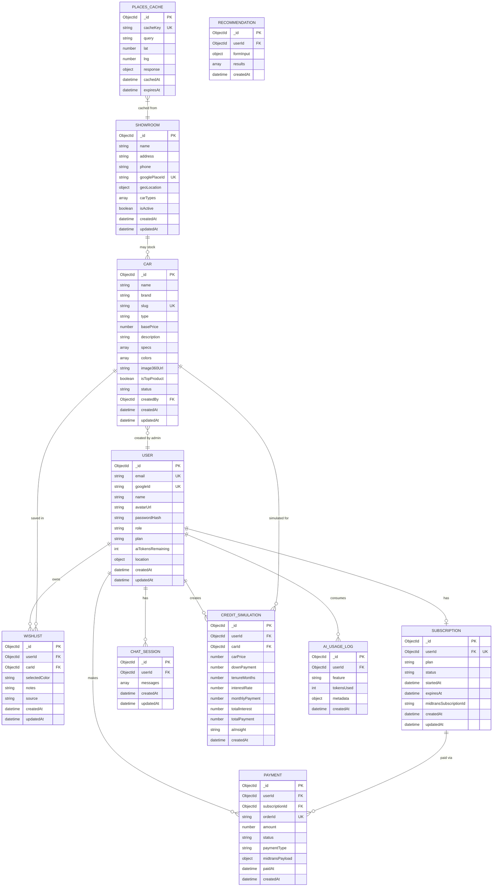
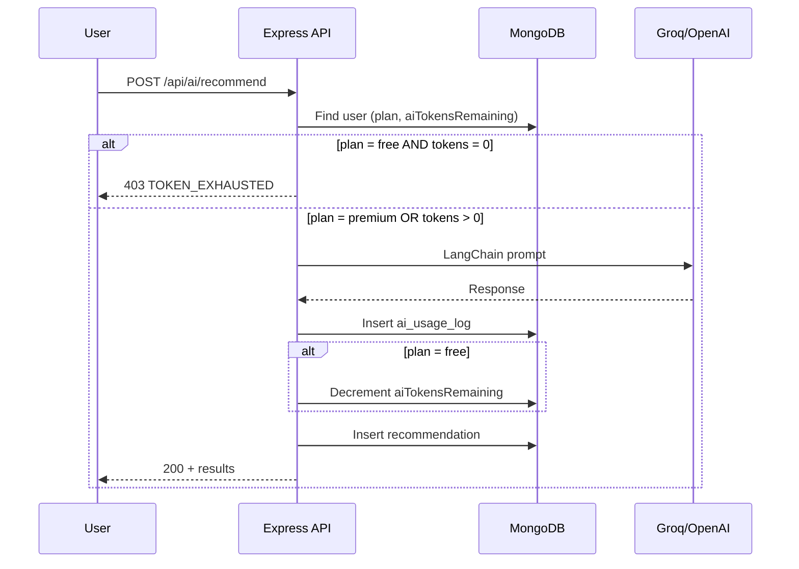

# Entity Relationship Diagram (ERD)
## Car Showroom AI — MVP

| Field | Value |
|-------|-------|
| **Database** | MongoDB (NoSQL) |
| **ORM** | Mongoloquent |
| **Versi** | 1.0 (MVP) |

> MongoDB menggunakan dokumen embedded & referensi (`ObjectId`). Diagram di bawah menggunakan notasi relasional untuk kejelasan, dengan catatan implementasi MongoDB di setiap entitas.

---

## 1. Diagram Overview



---

## 2. Relasi Antar Entitas

| Relasi | Kardinalitas | Keterangan |
|--------|--------------|------------|
| User → Wishlist | 1 : N | Satu user banyak item wishlist |
| User → Subscription | 1 : 1 | Satu user satu record subscription aktif |
| User → Payment | 1 : N | Riwayat pembayaran Midtrans |
| User → ChatSession | 1 : N | Riwayat sesi chatbot |
| User → CreditSimulation | 1 : N | Histori simulasi kredit |
| User → AiUsageLog | 1 : N | Audit penggunaan token AI |
| Car → Wishlist | 1 : N | Mobil bisa disimpan banyak user |
| Car → User (admin) | N : 1 | Mobil dibuat oleh admin |
| Subscription → Payment | 1 : N | Satu subscription bisa banyak payment (renewal) |
| Showroom ↔ Car | N : M | Showroom menyimpan array `carTypes` atau `carIds` |

---

## 3. Schema Detail (Mongoloquent Models)

### 3.1 `users`

```javascript
{
  _id: ObjectId,
  email: String,           // required, unique, indexed
  googleId: String,        // unique, sparse (null for admin-only)
  name: String,
  avatarUrl: String,
  passwordHash: String,    // optional, admin email login only
  role: {
    type: String,
    enum: ['buyer', 'admin'],
    default: 'buyer'
  },
  plan: {
    type: String,
    enum: ['free', 'premium'],
    default: 'free'
  },
  aiTokensRemaining: {
    type: Number,
    default: 5               // free tier starting quota
  },
  location: {
    lat: Number,
    lng: Number,
    address: String,
    updatedAt: Date
  },
  createdAt: Date,
  updatedAt: Date
}

// Indexes
// { email: 1 } unique
// { googleId: 1 } unique, sparse
```

---

### 3.2 `cars`

```javascript
{
  _id: ObjectId,
  name: String,              // e.g. "Avanza Veloz"
  brand: String,             // e.g. "Toyota"
  slug: String,              // unique, URL-friendly
  type: String,              // SUV | MPV | Sedan | Hatchback | Pickup
  basePrice: Number,         // IDR
  description: String,
  specs: {
    engine: String,
    transmission: String,
    fuelType: String,
    seats: Number,
    mileage: String          // "km/l"
  },
  colors: [                  // EMBEDDED — one image per color
    {
      name: String,            // "Pearl White"
      hexCode: String,         // "#FFFFFF"
      imageUrl: String,        // swap target on detail page
      availability: {
        type: String,
        enum: ['available', 'limited', 'out_of_stock'],
        default: 'available'
      }
    }
  ],
  image360Url: String,       // CI360 source (Top Product only)
  thumbnailUrl: String,
  isTopProduct: {
    type: Boolean,
    default: false           // only ONE true at a time (app logic)
  },
  status: {
    type: String,
    enum: ['active', 'inactive'],
    default: 'active'
  },
  createdBy: ObjectId,       // ref: users
  createdAt: Date,
  updatedAt: Date
}

// Indexes
// { slug: 1 } unique
// { isTopProduct: 1, status: 1 }
// { brand: 1, type: 1 }
// { basePrice: 1 }
```

---

### 3.3 `wishlists`

```javascript
{
  _id: ObjectId,
  userId: ObjectId,          // ref: users, required, indexed
  carId: ObjectId,           // ref: cars, required
  selectedColor: String,     // color name from car.colors[]
  notes: String,
  source: {
    type: String,
    enum: ['recommendation', 'detail_page', 'manual'],
    default: 'detail_page'
  },
  createdAt: Date,
  updatedAt: Date
}

// Indexes
// { userId: 1, carId: 1 } unique compound (prevent duplicate)
// { userId: 1, createdAt: -1 }
```

---

### 3.4 `subscriptions`

```javascript
{
  _id: ObjectId,
  userId: ObjectId,          // ref: users, unique (1:1)
  plan: {
    type: String,
    enum: ['free', 'premium'],
    default: 'free'
  },
  status: {
    type: String,
    enum: ['active', 'expired', 'cancelled', 'pending'],
    default: 'active'
  },
  startedAt: Date,
  expiresAt: Date,           // null for free; set for premium
  midtransSubscriptionId: String,
  createdAt: Date,
  updatedAt: Date
}

// Indexes
// { userId: 1 } unique
// { status: 1, expiresAt: 1 }
```

---

### 3.5 `payments`

```javascript
{
  _id: ObjectId,
  userId: ObjectId,          // ref: users
  subscriptionId: ObjectId,  // ref: subscriptions
  orderId: String,           // Midtrans order_id, unique
  amount: Number,
  status: {
    type: String,
    enum: ['pending', 'success', 'failed', 'expired', 'refunded'],
    default: 'pending'
  },
  paymentType: String,       // "premium_monthly" | "premium_yearly"
  midtransPayload: Object,   // full webhook/callback body
  paidAt: Date,
  createdAt: Date
}

// Indexes
// { orderId: 1 } unique
// { userId: 1, createdAt: -1 }
```

---

### 3.6 `showrooms`

```javascript
{
  _id: ObjectId,
  name: String,
  address: String,
  phone: String,
  googlePlaceId: String,     // unique, sparse
  geoLocation: {
    type: {
      type: String,
      enum: ['Point'],
      default: 'Point'
    },
    coordinates: [Number]      // [longitude, latitude]
  },
  carTypes: [String],          // ["MPV", "SUV"] — types available
  carIds: [ObjectId],          // optional: specific cars in stock
  isActive: {
    type: Boolean,
    default: true
  },
  createdAt: Date,
  updatedAt: Date
}

// Indexes
// { geoLocation: '2dsphere' }  — geospatial queries
// { googlePlaceId: 1 } unique, sparse
```

---

### 3.7 `chat_sessions`

```javascript
{
  _id: ObjectId,
  userId: ObjectId,          // ref: users
  messages: [
    {
      role: {
        type: String,
        enum: ['user', 'assistant', 'system']
      },
      content: String,
      timestamp: Date
    }
  ],
  createdAt: Date,
  updatedAt: Date
}

// Indexes
// { userId: 1, updatedAt: -1 }
```

---

### 3.8 `credit_simulations`

```javascript
{
  _id: ObjectId,
  userId: ObjectId,          // ref: users (nullable for guest — MVP: require login)
  carId: ObjectId,           // ref: cars, optional
  carPrice: Number,
  downPayment: Number,
  tenureMonths: Number,      // 12, 24, 36, 48, 60
  interestRate: Number,      // annual % e.g. 5.5
  monthlyPayment: Number,    // calculated
  totalInterest: Number,
  totalPayment: Number,
  aiInsight: String,         // AI-generated summary
  createdAt: Date
}

// Indexes
// { userId: 1, createdAt: -1 }
```

---

### 3.9 `ai_usage_logs`

```javascript
{
  _id: ObjectId,
  userId: ObjectId,          // ref: users
  feature: {
    type: String,
    enum: ['recommendation', 'chatbot', 'credit_simulation']
  },
  tokensUsed: {
    type: Number,
    default: 1
  },
  metadata: {
    carId: ObjectId,
    sessionId: ObjectId,
    promptTokens: Number,
    completionTokens: Number
  },
  createdAt: Date
}

// Indexes
// { userId: 1, createdAt: -1 }
// { userId: 1, feature: 1 }
```

---

### 3.10 `recommendations`

```javascript
{
  _id: ObjectId,
  userId: ObjectId,          // ref: users, nullable for guest trial
  formInput: {
    budgetMin: Number,
    budgetMax: Number,
    carType: String,
    passengers: Number,
    priority: String,
    preferredColor: String
  },
  results: [
    {
      carId: ObjectId,
      carName: String,
      matchScore: Number,    // 0-100
      suggestedColors: [String],
      reason: String         // AI explanation
    }
  ],
  createdAt: Date
}

// Indexes
// { userId: 1, createdAt: -1 }
```

---

### 3.11 `places_cache`

```javascript
{
  _id: ObjectId,
  cacheKey: String,          // e.g. "nearby:-6.2:106.8:5000" (lat:lng:radius)
  query: String,
  lat: Number,
  lng: Number,
  radius: Number,            // meters
  response: Object,          // raw Google Places API response
  cachedAt: Date,
  expiresAt: Date            // TTL index target
}

// Indexes
// { cacheKey: 1 } unique
// { expiresAt: 1 } TTL index — MongoDB auto-delete expired docs
```

---

## 4. Diagram Embedded vs Referenced

```
┌─────────────────────────────────────────────────────────────┐
│                        cars                                  │
│  ┌─────────────────────────────────────────────────────┐    │
│  │ colors[] (EMBEDDED)                                  │    │
│  │  ├── name, hexCode, imageUrl, availability          │    │
│  │  └── ...                                             │    │
│  └─────────────────────────────────────────────────────┘    │
│  specs (EMBEDDED object)                                     │
└─────────────────────────────────────────────────────────────┘

┌──────────────┐         ObjectId ref         ┌──────────────┐
│   wishlists  │ ──────── userId ───────────► │    users     │
│              │ ──────── carId ────────────► │              │
└──────────────┘                              └──────────────┘

┌──────────────┐         ObjectId ref         ┌──────────────┐
│chat_sessions │ ──────── userId ───────────► │    users     │
│  messages[]  │ (EMBEDDED array)             │              │
└──────────────┘                              └──────────────┘
```

**Keputusan desain:**
- **Colors embedded di `cars`** — MVP: warna selalu tied to product, tidak perlu collection terpisah; swap image = lookup array by `name`.
- **Messages embedded di `chat_sessions`** — conversation kecil, avoid join; cap 100 messages/session jika perlu.
- **Subscription terpisah dari User** — memudahkan webhook Midtrans update tanpa touch user doc langsung (sync `users.plan` via hook).

---

## 5. Business Rules (Database Level)

| Rule | Implementasi |
|------|--------------|
| Hanya 1 Top Product | Pre-save hook: jika `isTopProduct=true`, set semua car lain `false` |
| Wishlist no duplicate | Compound unique index `{ userId, carId }` |
| AI token tidak negatif | Pre-hook AI endpoint: check `aiTokensRemaining > 0` atau `plan=premium` |
| Premium unlimited | Skip decrement jika `plan === 'premium'` |
| Free tier default | On user create: `aiTokensRemaining=5`, `plan='free'` |
| Places cache TTL | TTL index on `expiresAt`, default 7 hari |
| Geo nearest showroom | `$near` query on `showrooms.geoLocation` with `2dsphere` index |

---

## 6. Token Consumption Flow



---

## 7. Seed Data Minimum (MVP)

| Collection | Min Records | Notes |
|------------|-------------|-------|
| users | 2 | 1 admin, 1 buyer test |
| cars | 5 | 1 Top Product with 360 URL |
| showrooms | 3 | With geoLocation Jakarta area |
| subscriptions | 1 | Free tier for test buyer |

**Contoh car seed:**

```javascript
{
  name: "Innova Zenix",
  brand: "Toyota",
  slug: "toyota-innova-zenix",
  type: "MPV",
  basePrice: 450000000,
  isTopProduct: true,
  image360Url: "https://cdn.example.com/360/innova-zenix/",
  colors: [
    { name: "Platinum White", hexCode: "#F5F5F5", imageUrl: ".../white.jpg", availability: "available" },
    { name: "Attitude Black", hexCode: "#1A1A1A", imageUrl: ".../black.jpg", availability: "available" },
    { name: "Crimson Red", hexCode: "#8B0000", imageUrl: ".../red.jpg", availability: "limited" }
  ]
}
```

---

## 8. Zod Validation Schemas (Request ↔ Model Mapping)

| Endpoint | Zod Schema Fields |
|----------|-------------------|
| POST `/api/cars` | name, brand, type, basePrice, description, specs, colors[], image360Url |
| POST `/api/wishlist` | carId, selectedColor?, notes?, source? |
| POST `/api/ai/recommend` | budgetMin, budgetMax, carType, passengers, priority |
| POST `/api/ai/chat` | sessionId?, message |
| POST `/api/ai/credit-simulate` | carPrice, downPayment, tenureMonths, interestRate, carId? |
| POST `/api/subscription/checkout` | paymentType |

---

## 9. Collections Summary

| Collection | Est. Docs (MVP) | Growth |
|------------|-----------------|--------|
| users | 100 | Linear |
| cars | 10–50 | Slow |
| wishlists | 500 | Linear with users |
| subscriptions | = users | 1:1 |
| payments | 50 | With conversions |
| chat_sessions | 200 | Per active user |
| credit_simulations | 300 | Per user interest |
| ai_usage_logs | 1000 | High — consider archival |
| recommendations | 500 | Per AI call |
| places_cache | 100 | Bounded by TTL |
| showrooms | 10–20 | Slow |

---

## 10. Future Extensions (Post-MVP)

- Collection `notifications` untuk push/email
- Collection `car_comparisons` untuk compare 2–3 mobil side-by-side
- Separate `colors` collection jika katalog warna shared antar model
- `dealers` entity terpisah dari `showrooms`
- Sharding `ai_usage_logs` by month
