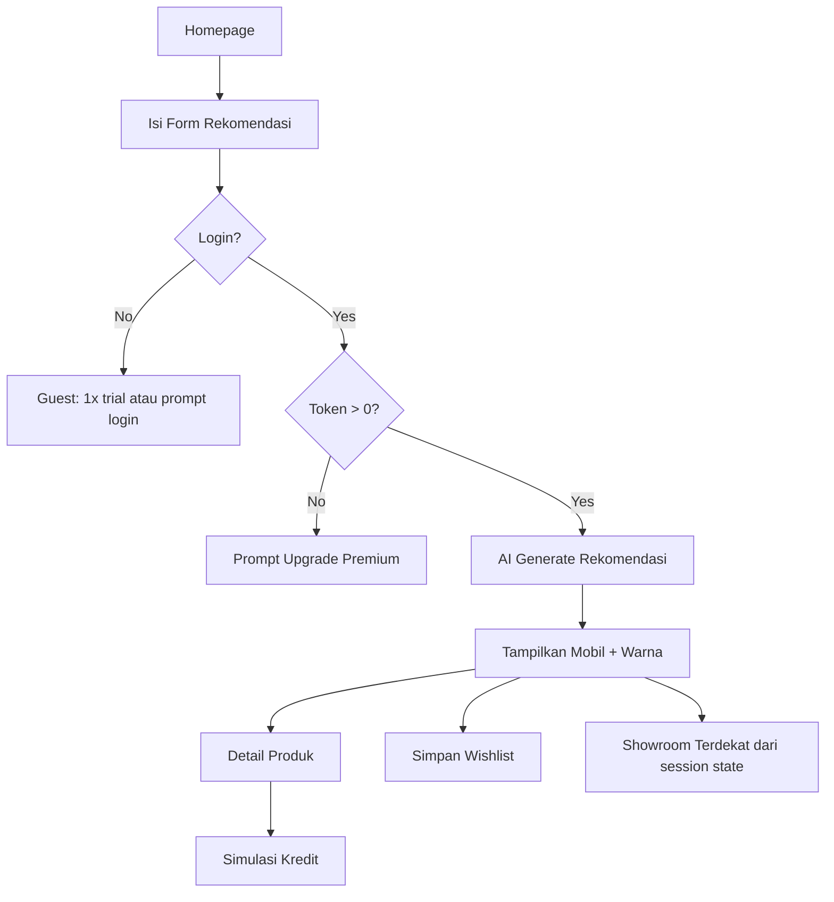
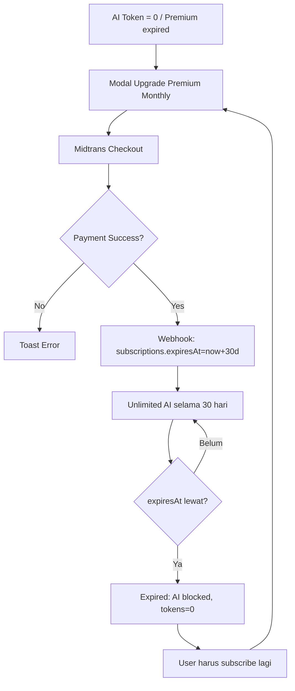
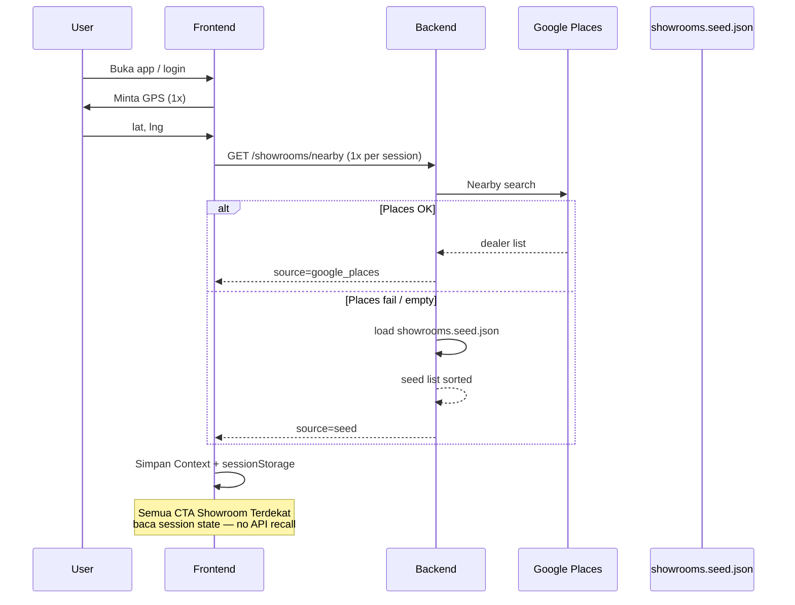
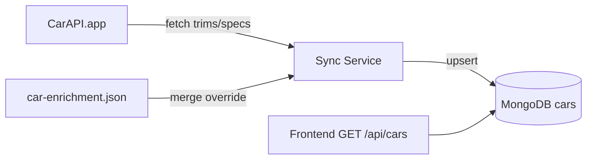

# Product Requirements Document (PRD)
## RAC (Recommendation Auto Car) AI — MVP Lite

| Field | Value |
|-------|-------|
| **Versi** | 1.3 (MVP Lite + CarAPI + ERD simplification) |
| **Timeline** | 7 hari penuh |
| **Tim** | 4 orang |
| **Platform** | Web SPA, mobile-first |
| **Tanggal** | Agustus 2026 |

---

## 1. Ringkasan Eksekutif

RAC (Recommendation Auto Car) AI adalah aplikasi web mobile-first yang membantu calon pembeli mobil menemukan tipe mobil, membandingkan warna, mensimulasikan kredit, dan menemukan showroom terdekat — dengan bantuan AI untuk rekomendasi dan chatbot.

MVP difokuskan pada **satu alur utama**: user masuk → dapat rekomendasi mobil → lihat detail & warna → simpan ke wishlist → (opsional) simulasi kredit → temukan showroom terdekat. Fitur premium (AI unlimited) dijual via Midtrans.

**MVP Lite:** katalog mobil via **CarAPI.app sync** + override manual; showroom **seed** + Google Places **1x/session** (Opsi A); **tanpa admin panel**; auth **Google buyer only**.

---

## 2. Tujuan & Ruang Lingkup

### 2.1 Tujuan MVP

| # | Tujuan | Metrik Sukses |
|---|--------|---------------|
| 1 | User dapat rekomendasi mobil berbasis form + AI | ≥ 1 rekomendasi valid per sesi |
| 2 | User dapat eksplorasi produk (360°, warna, deskripsi) | Bounce rate detail < 60% |
| 3 | Monetisasi freemium via Midtrans | Flow pembayaran end-to-end berhasil |
| 4 | Auth Google + wishlist berfungsi | Login & CRUD wishlist tanpa error |

### 2.2 In Scope (MVP Lite)

- Homepage: banner Top Product dengan view 360° (CI360)
- Form rekomendasi mobil + output AI (tipe, warna, CTA showroom terdekat)
- Halaman detail produk: deskripsi, swap gambar per warna, ketersediaan warna
- Chatbot AI (LangChain + Groq/OpenAI)
- Simulasi kredit (form + perhitungan AI-assisted)
- Auth: Sign in with Google + JWT, role **`buyer` only**
- CRUD wishlist
- Subscription freemium: free 5x AI → token habis → upgrade premium monthly (Midtrans)
- **Katalog mobil:** sync **[CarAPI.app](https://carapi.app/)** (specs YMMT) → MongoDB + **enrichment manual** (harga IDR, warna, CI360)
- **Showroom terdekat:** Google Places (Opsi A) + fallback seed; **1x fetch per session** di frontend

### 2.4 Keputusan Scope MVP Lite

| Area | Keputusan | Catatan |
|------|-----------|---------|
| **Katalog mobil** | **CarAPI.app sync** + `config/car-enrichment.json` | Specs otomatis; harga IDR, warna, 360° manual |
| **Showroom** | Opsi A: Places → fallback seed JSON | Runtime only; seed di `config/showrooms.seed.json` (bukan MongoDB) |
| **Google Places** | **1x per session** (frontend Context + `sessionStorage`) | Backend stateless |
| **Admin** | Skip | Sync via script; enrichment via JSON |
| **Auth** | Google OAuth buyer only | JWT 24h |

---

## 3. Persona Pengguna

### 3.1 Buyer (Calon Pembeli)
- Usia 25–45, mobile-first
- Butuh rekomendasi cepat tanpa datang ke showroom dulu
- Freemium: coba AI 5 kali, upgrade jika puas

---

## 4. Model Bisnis & Subscription

```
┌─────────────┐     5x AI used      ┌──────────────┐
│  FREE tier  │ ──────────────────► │ Token empty  │
│  aiTokens=5 │                     │  aiTokens=0  │
└─────────────┘                     └──────┬───────┘
                                         │
                              Midtrans payment (monthly)
                                         ▼
                                  ┌──────────────┐
                                  │   PREMIUM    │
                                  │ 30 hari aktif│
                                  │ AI unlimited │
                                  └──────┬───────┘
                                         │
                                   expiresAt lewat
                                         ▼
                                  ┌──────────────┐
                                  │   EXPIRED    │
                                  │ AI blocked   │
                                  │ tokens = 0   │
                                  └──────┬───────┘
                                         │
                              Subscribe lagi (Midtrans)
                                         ▼
                                  ┌──────────────┐
                                  │   PREMIUM    │
                                  │ +30 hari baru│
                                  └──────────────┘
```

| Tier | Durasi | AI Quota | Fitur |
|------|--------|----------|-------|
| **Free** | Permanen | 5 penggunaan (rekomendasi + chatbot + kredit AI = 1 token each) | Semua fitur UI, quota terbatas |
| **Premium Monthly** | **30 hari** per pembayaran | Unlimited | Semua fitur AI tanpa batas selama aktif |
| **Expired** | — | **0 (blocked)** | UI tetap bisa; **semua fitur AI diblok** sampai subscribe ulang |

### Aturan Premium Monthly

| Aturan | Detail |
|--------|--------|
| **Jenis plan** | Hanya `premium_monthly` (MVP tidak ada yearly) |
| **Durasi** | 30 hari sejak `startedAt` → `expiresAt = startedAt + 30 hari` |
| **Saat bayar sukses** | Upsert `subscriptions`: `expiresAt = now + 30d`, `paymentStatus=success`; AI unlimited |
| **Saat expired** | `expiresAt <= now` → `aiTokensRemaining=0`, **AI diblok** |
| **Renewal** | **Manual** — user harus **subscribe lagi** via Midtrans; tidak ada auto-renew MVP |
| **Setelah re-subscribe** | `expiresAt` diperpanjang +30 hari dari tanggal pembayaran baru |

**Token consumption (free tier):** Setiap panggilan ke endpoint AI (rekomendasi, chatbot message, simulasi kredit AI) mengurangi 1 token.

**Akses AI diizinkan jika:** `subscriptions.expiresAt > now` (premium aktif) **ATAU** (free tier) `aiTokensRemaining > 0`. Selain itu → `403 TOKEN_EXHAUSTED` / prompt upgrade.

---

## 5. Arsitektur Teknis

| Layer | Technology | Notes |
|-------|------------|-------|
| Frontend | React, Tailwind CSS, DaisyUI | SPA, mobile-first |
| Notifications | React-Toastify | Success/error toast |
| Confirmations | SweetAlert2 | Delete / destructive actions |
| 360° View | cloudimage-360-view (CI360) | Home Top Product only |
| Detail colors | One image per color | Image swap on select |
| Server | Node.js + Express | REST API |
| Validation | Zod | Request schemas |
| Auth | JWT + Google OAuth | Role: **buyer only** |
| Database | MongoDB | Atlas or local |
| ORM | Mongoloquent | Models + validation |
| Car catalog | [CarAPI.app](https://carapi.app/) | Sync specs (server-side); free demo dataset 2015–2020 |
| Maps | Google Places API | Live 1x/session; no MongoDB cache |
| AI | Groq / OpenAI + LangChain | Chatbot & recommendations |
| Payment | Midtrans | Subscription SaaS |

---

## 6. Functional Requirements

### 6.1 Homepage

| ID | Requirement | Priority |
|----|-------------|----------|
| HP-01 | Tampilkan **1 Top Product** sebagai hero banner | P0 |
| HP-02 | Integrasi **CI360** untuk rotasi 360° pada Top Product | P0 |
| HP-03 | Section **AI Recommendation**: form input (budget, kebutuhan, penumpang, dll.) | P0 |
| HP-04 | Output rekomendasi: tipe mobil, pilihan warna, CTA ke detail | P0 |
| HP-05 | CTA **Showroom Terdekat** dari session state (sudah di-fetch 1x) | P0 |
| HP-06 | Navigasi ke chatbot, auth, wishlist | P1 |

**Form Rekomendasi (contoh field):**
- Budget (min–max)
- Tipe kebutuhan (keluarga, city car, SUV, dll.)
- Jumlah penumpang
- Prioritas (hemat BBM, performa, luxury)
- Preferensi warna (opsional)

**Acceptance Criteria HP-02:**
- Gambar 360° load < 5 detik di 4G
- Fallback ke gambar statis jika CI360 gagal

---

### 6.2 Halaman Detail Produk Mobil

| ID | Requirement | Priority |
|----|-------------|----------|
| PD-01 | Tampilkan nama, brand, harga, spesifikasi, deskripsi | P0 |
| PD-02 | **Color picker**: swap gambar saat warna dipilih (1 image per color) | P0 |
| PD-03 | Indikator ketersediaan warna (available / limited / out) | P0 |
| PD-04 | Tombol **Tambah ke Wishlist** | P0 |
| PD-05 | Link ke simulasi kredit | P1 |
| PD-06 | Link ke showroom terdekat untuk tipe ini | P1 |

---

### 6.3 Chatbot AI (LangChain)

| ID | Requirement | Priority |
|----|-------------|----------|
| CB-01 | Widget chat floating / halaman dedicated | P0 |
| CB-02 | Context-aware: tahu katalog mobil dari DB | P0 |
| CB-03 | Setiap message user = -1 AI token (free tier) | P0 |
| CB-04 | Block chat jika token habis + prompt upgrade | P0 |
| CB-05 | ~~Simpan riwayat sesi~~ | **Out** — chat stateless, tidak persist |

**Contoh intent:** "Mobil apa cocok budget 300 juta keluarga 5 orang?"

---

### 6.4 Simulasi Kredit AI

| ID | Requirement | Priority |
|----|-------------|----------|
| CR-01 | Form: harga mobil, DP, tenor (12–60 bln), suku bunga | P0 |
| CR-02 | Output: cicilan bulanan, total bunga, total bayar | P0 |
| CR-03 | AI memberikan insight singkat (affordable / tips) | P1 |
| CR-04 | Pre-fill harga dari detail produk | P1 |

---

### 6.5 Authentication

| ID | Requirement | Priority |
|----|-------------|----------|
| AU-01 | Sign in with Google (OAuth 2.0) | P0 |
| AU-02 | Issue JWT (access token, expiry 24h) | P0 |
| AU-03 | Role fixed: `buyer` (default & only) | P0 |
| AU-04 | Protected routes: wishlist, subscription | P0 |

---

### 6.6 Wishlist (CRUD)

| ID | Requirement | Priority |
|----|-------------|----------|
| WL-01 | Create: simpan mobil (+ warna opsional) dari rekomendasi/detail | P0 |
| WL-02 | Read: list wishlist user | P0 |
| WL-03 | Update: catatan / ganti warna pilihan | P1 |
| WL-04 | Delete: hapus item (SweetAlert2 confirm) | P0 |
| WL-05 | Toast success/error (React-Toastify) | P0 |

---

### 6.7 Subscription & Midtrans

| ID | Requirement | Priority |
|----|-------------|----------|
| SU-01 | User baru: `aiTokensRemaining=5`, belum ada record `subscriptions` | P0 |
| SU-02 | Decrement token on AI usage (free tier only) | P0 |
| SU-03 | Halaman upgrade premium monthly + harga | P0 |
| SU-04 | Midtrans Snap payment flow (`paymentType: premium_monthly`) | P0 |
| SU-05 | Webhook Midtrans → upsert `subscriptions` (`startedAt`, `expiresAt`, `paymentStatus=success`) | P0 |
| SU-06 | Tampilkan badge premium + tanggal `expiresAt` di profil | P1 |
| SU-07 | Cron/job cek `expiresAt`: jika lewat → `aiTokensRemaining=0` | P0 |
| SU-08 | Setelah expired, **blok semua endpoint AI** + prompt subscribe ulang | P0 |
| SU-09 | Re-subscribe: pembayaran Midtrans baru → perpanjang premium +30 hari | P0 |

---

### 6.8 Showroom & Google Places (Opsi A)

| ID | Requirement | Priority |
|----|-------------|----------|
| SH-01 | **Session init (frontend):** minta GPS 1x → panggil `GET /api/showrooms/nearby?lat=&lng=` **1x per session** | P0 |
| SH-02 | Simpan hasil di **React Context** + `sessionStorage` (semua CTA showroom baca dari sini, tanpa API ulang) | P0 |
| SH-03 | **Backend Opsi A:** coba Google Places → sukses return Places; gagal/kosong → fallback baca `config/showrooms.seed.json` (sort by distance) | P0 |
| SH-04 | Response API sertakan `source: "google_places" \| "seed"` | P0 |
| SH-05 | Tampilkan nama, alamat, jarak, link Google Maps | P0 |
| SH-06 | GPS ditolak → default koordinat Jakarta → fetch nearby 1x | P1 |

**Alur backend nearby (Opsi A):**

```
GET /api/showrooms/nearby?lat=&lng=
  1. Call Google Places API (car dealer, radius ~10 km)
  2. IF sukses && hasil tidak kosong → return { source: "google_places", data: [...] }
  3. ELSE → load config/showrooms.seed.json → sort by distance → return { source: "seed", data: [...] }
```

**Seed showroom:** min. 3 entry di `config/showrooms.seed.json` (lat/lng Jakarta) sebagai fallback demo — **bukan collection MongoDB**.

---

### 6.9 Katalog Mobil (CarAPI.app Sync + Enrichment)

| ID | Requirement | Priority |
|----|-------------|----------|
| CT-01 | Sync job: fetch makes/models/trims dari **CarAPI.app** → upsert ke MongoDB `cars` | P0 |
| CT-02 | Mapper: CarAPI fields → schema `cars` (name, brand, slug, type, specs, description) | P0 |
| CT-03 | **Enrichment manual** via `config/car-enrichment.json` merge saat sync | P0 |
| CT-04 | Enrichment wajib isi: `basePrice` (IDR), `colors[]`, `thumbnailUrl`; Top Product: `image360Url` | P0 |
| CT-05 | Tepat 1 mobil `isTopProduct: true` (set di enrichment) | P0 |
| CT-06 | API **read-only** user-facing: `GET /api/cars`, `/top`, `/:id` | P0 |
| CT-07 | Trigger sync: `npm run sync:cars` dan/atau `POST /api/internal/sync/cars` (dev-only) | P0 |

**Field dari CarAPI (otomatis):**

| CarAPI | → `cars` |
|--------|----------|
| make | brand |
| model + trim | name |
| body type | type (SUV/MPV/Sedan mapping) |
| engine, transmission, fuel | specs |
| MSRP / description | description (MSRP **tidak** dipakai langsung sebagai harga jual IDR) |

**Field dari enrichment (manual `config/car-enrichment.json`):**

```json
{
  "toyota-camry-xle": {
    "basePrice": 450000000,
    "isTopProduct": true,
    "image360Url": "https://cdn.example.com/360/camry/",
    "colors": [
      { "name": "Pearl White", "hexCode": "#F5F5F5", "imageUrl": ".../white.jpg", "availability": "available" }
    ]
  }
}
```

**Alur sync:**

```
npm run sync:cars
  1. Login CarAPI (JWT) — production; atau demo dataset tanpa akun (dev)
  2. Fetch trims by filter (e.g. Toyota, Honda, MPV/SUV)
  3. Map → upsert cars by slug
  4. Merge car-enrichment.json (override basePrice, colors, 360°, isTopProduct)
  5. Log: created / updated / skipped
```

**Catatan CarAPI MVP demo:**
- Free public dataset: **2015–2020**, no signup — cukup untuk pipeline sync POC
- Production go-live: subscribe CarAPI (Base ~$199/tahun) untuk dataset lengkap
- CarAPI **server-side only** (no CORS) — sync wajib di backend

---

## 7. API Endpoints (REST)

### Auth
| Method | Endpoint | Description |
|--------|----------|-------------|
| POST | `/api/auth/google` | Google OAuth → JWT |
| GET | `/api/auth/me` | Current user + subscription |
| POST | `/api/auth/logout` | Invalidate token (client-side) |

### Cars (read-only, data from CarAPI sync)
| Method | Endpoint | Description |
|--------|----------|-------------|
| GET | `/api/cars` | List cars from MongoDB (synced + enriched) |
| GET | `/api/cars/top` | Top Product for homepage |
| GET | `/api/cars/:id` | Detail + colors + availability |

### Internal (dev-only)
| Method | Endpoint | Description |
|--------|----------|-------------|
| POST | `/api/internal/sync/cars` | Trigger CarAPI sync + enrichment merge |

### AI
| Method | Endpoint | Description |
|--------|----------|-------------|
| POST | `/api/ai/recommend` | Form → car recommendations |
| POST | `/api/ai/chat` | Chatbot message |
| POST | `/api/ai/credit-simulate` | Credit simulation + AI insight |

### Wishlist
| Method | Endpoint | Description |
|--------|----------|-------------|
| GET | `/api/wishlist` | User wishlist |
| POST | `/api/wishlist` | Add item |
| PUT | `/api/wishlist/:id` | Update item |
| DELETE | `/api/wishlist/:id` | Remove item |

### Showrooms
| Method | Endpoint | Description |
|--------|----------|-------------|
| GET | `/api/showrooms/nearby?lat=&lng=` | Places (Opsi A) → fallback seed; **called 1x/session from frontend** |

### Subscription
| Method | Endpoint | Description |
|--------|----------|-------------|
| GET | `/api/subscription/status` | `expiresAt`, tokens, days remaining |
| POST | `/api/subscription/checkout` | Create Midtrans transaction (`premium_monthly` only) |
| POST | `/api/subscription/webhook` | Midtrans callback → activate/extend premium |

---

## 8. Non-Functional Requirements

| Kategori | Requirement |
|----------|-------------|
| **Performance** | FCP < 2s mobile 4G; API response < 500ms (non-AI) |
| **Responsive** | Mobile-first; breakpoints: 375px, 768px, 1024px |
| **Security** | JWT httpOnly cookie or Bearer; Zod validation all inputs |
| **Availability** | MVP target 99% uptime (best effort) |
| **AI Fallback** | Graceful error jika Groq/OpenAI down |
| **Accessibility** | Semantic HTML, contrast ratio WCAG AA (best effort MVP) |

---

## 9. User Flows

### 9.1 Flow Rekomendasi → Wishlist



### 9.2 Flow Subscription



### 9.3 Flow Showroom Session (1x per session)



### 9.4 Flow Car Sync (CarAPI + Enrichment)



---

## 10. Pembagian Tim (7 Hari)

| Hari | Frontend (2 dev) | Backend (1 dev) | Full-stack / AI (1 dev) |
|------|------------------|-----------------|-------------------------|
| **D1** | Setup React + Tailwind + ShowroomProvider | Express + Mongo + CarAPI sync POC | AI/LangChain POC + schema |
| **D2** | Homepage + CI360 + GPS session init | CarAPI mapper + enrichment merge + read API | Google OAuth + JWT |
| **D3** | Detail produk + color swap | Wishlist API | AI recommend endpoint |
| **D4** | Form rekomendasi UI + results | Showrooms Opsi A (Places + seed) | Chatbot LangChain |
| **D5** | Chatbot UI + credit form | Subscription + Midtrans webhook | Credit AI simulation |
| **D6** | Wishlist + auth flows | Expiry cron + showrooms.seed.json | Integration testing |
| **D7** | Polish UI + toast/swal | E2E sync + deploy | E2E test + deploy |

---

## 11. Risiko & Mitigasi

| Risiko | Impact | Mitigasi |
|--------|--------|----------|
| CarAPI quota / demo dataset limit | Katalog terbatas | Free tier 2015–2020 untuk dev; filter 5–10 model; enrichment lengkap |
| Google Places API quota / error | Showroom gagal load | Opsi A fallback seed; Places 1x/session |
| AI latency tinggi | UX buruk | Loading skeleton; Groq sebagai primary |
| Midtrans sandbox delay | Testing terhambat | Setup sandbox day 1 |
| CI360 asset belum siap | Homepage kosong | Fallback static hero image |
| 7 hari terlalu ketat | Fitur incomplete | Prioritas P0 only; P2 ditunda |

---

## 12. Definisi Selesai (Definition of Done)

- [ ] Semua requirement P0 terimplementasi
- [ ] Mobile layout diuji di viewport 375px
- [ ] Auth Google + JWT berfungsi
- [ ] AI token decrement + block saat habis
- [ ] Midtrans payment sandbox success → premium active 30 hari
- [ ] Premium expired → AI blocked + prompt re-subscribe
- [ ] Wishlist CRUD lengkap dengan toast & confirm delete
- [ ] CarAPI sync + enrichment merge menghasilkan **5–10 mobil** di MongoDB
- [ ] 1 Top Product + CI360 + colors[] dari enrichment
- [ ] **3 showroom** di `config/showrooms.seed.json` (fallback Places)
- [ ] Showroom: Places 1x/session + fallback seed teruji
- [ ] `npm run sync:cars` documented di README
- [ ] README setup local + env variables documented

---

## 13. Environment Variables

```env
# Server
PORT=5000
MONGODB_URI=
JWT_SECRET=

# Google
GOOGLE_CLIENT_ID=
GOOGLE_CLIENT_SECRET=
GOOGLE_PLACES_API_KEY=

# CarAPI (https://carapi.app) — server-side sync only
CARAPI_API_TOKEN=
CARAPI_API_SECRET=
SYNC_SECRET=                    # guard POST /api/internal/sync/cars

# AI
GROQ_API_KEY=
OPENAI_API_KEY=

# Midtrans
MIDTRANS_SERVER_KEY=
MIDTRANS_CLIENT_KEY=
MIDTRANS_IS_PRODUCTION=false

# Frontend
VITE_API_URL=
VITE_GOOGLE_CLIENT_ID=
VITE_MIDTRANS_CLIENT_KEY=
```

---

## 14. Glosarium

| Term | Definisi |
|------|----------|
| **Top Product** | Satu mobil unggulan di homepage dengan view 360° |
| **AI Token** | Kuota penggunaan fitur AI per user free tier (5x) |
| **Premium Monthly** | Langganan berbayar 30 hari via Midtrans; AI unlimited selama aktif; expired = harus subscribe ulang |
| **CI360** | cloudimage-360-view library untuk rotasi produk |
| **CarAPI Sync** | Pipeline backend: fetch specs dari CarAPI.app → upsert MongoDB |
| **Enrichment** | Override manual via `config/car-enrichment.json` (harga IDR, warna, CI360) |
| **Showroom Session** | Fetch nearby 1x per browser session |
| **Opsi A** | Places primary, seed fallback |
| **Mongoloquent** | ODM/ORM untuk MongoDB di Node.js |