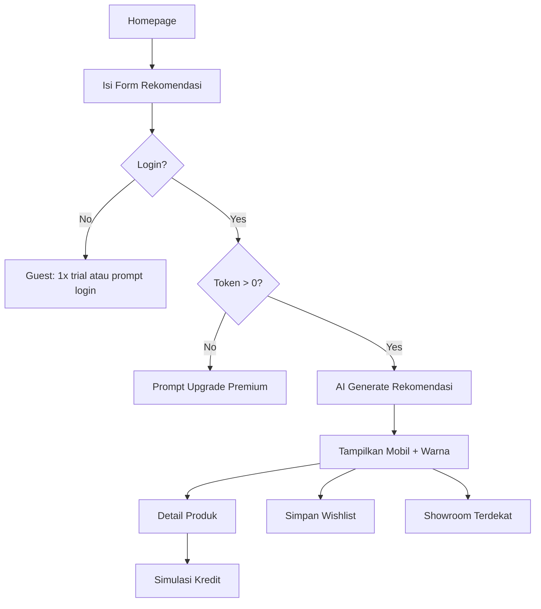
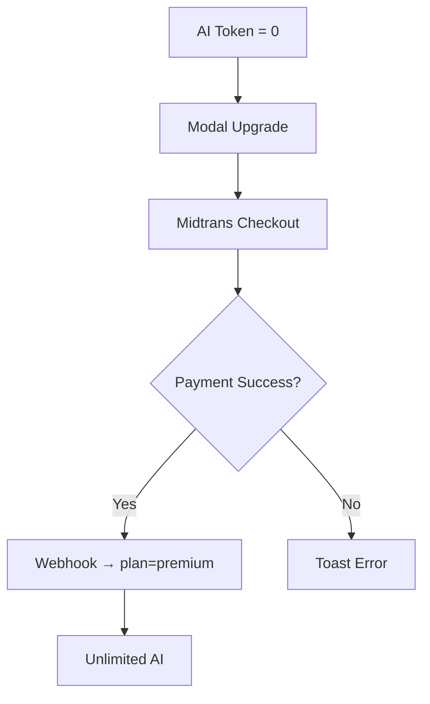

# Product Requirements Document (PRD)
## Car Showroom AI — MVP

| Field | Value |
|-------|-------|
| **Versi** | 1.0 (MVP) |
| **Timeline** | 7 hari penuh |
| **Tim** | 4 orang |
| **Platform** | Web SPA, mobile-first |
| **Tanggal** | Agustus 2026 |

---

## 1. Ringkasan Eksekutif

Car Showroom AI adalah aplikasi web mobile-first yang membantu calon pembeli mobil menemukan tipe mobil, membandingkan warna, mensimulasikan kredit, dan menemukan showroom terdekat — dengan bantuan AI untuk rekomendasi dan chatbot.

MVP difokuskan pada **satu alur utama**: user masuk → dapat rekomendasi mobil → lihat detail & warna → simpan ke wishlist → (opsional) simulasi kredit → temukan showroom terdekat. Fitur premium (AI unlimited) dijual via Midtrans.

---

## 2. Tujuan & Ruang Lingkup

### 2.1 Tujuan MVP

| # | Tujuan | Metrik Sukses |
|---|--------|---------------|
| 1 | User dapat rekomendasi mobil berbasis form + AI | ≥ 1 rekomendasi valid per sesi |
| 2 | User dapat eksplorasi produk (360°, warna, deskripsi) | Bounce rate detail < 60% |
| 3 | Monetisasi freemium via Midtrans | Flow pembayaran end-to-end berhasil |
| 4 | Auth Google + wishlist berfungsi | Login & CRUD wishlist tanpa error |

### 2.2 In Scope (MVP)

- Homepage: banner Top Product dengan view 360° (CI360)
- Form rekomendasi mobil + output AI (tipe, warna, link showroom terdekat)
- Halaman detail produk: deskripsi, swap gambar per warna, ketersediaan warna
- Chatbot AI (LangChain + Groq/OpenAI)
- Simulasi kredit (form + perhitungan AI-assisted)
- Auth: Sign in with Google + JWT, role `buyer` / `admin`
- CRUD wishlist
- Subscription freemium: free 5x AI → token habis → upgrade premium (Midtrans)
- Admin CRUD produk mobil (minimal)
- Cache Google Places ke MongoDB

### 2.3 Out of Scope (MVP)

- Native mobile app (iOS/Android)
- Multi-bahasa
- Real-time inventory sync dengan dealer
- Push notification
- Review/rating user
- Chat langsung dengan sales
- Pembayaran DP mobil (hanya subscription SaaS)
- Analytics dashboard lengkap

---

## 3. Persona Pengguna

### 3.1 Buyer (Calon Pembeli)
- Usia 25–45, mobile-first
- Butuh rekomendasi cepat tanpa datang ke showroom dulu
- Freemium: coba AI 5 kali, upgrade jika puas

### 3.2 Admin
- Staff showroom / product owner
- Kelola katalog mobil, set Top Product, monitor subscription (basic)

---

## 4. Model Bisnis & Subscription

```
┌─────────────┐     5x AI used      ┌──────────────┐
│  FREE tier  │ ──────────────────► │ Token empty  │
│  aiTokens=5 │                     │  aiTokens=0  │
└─────────────┘                     └──────┬───────┘
                                         │
                              Midtrans payment
                                         ▼
                                  ┌──────────────┐
                                  │   PREMIUM    │
                                  │ aiTokens=∞   │
                                  │ (or high cap)│
                                  └──────────────┘
```

| Tier | AI Quota | Fitur |
|------|----------|-------|
| **Free** | 5 penggunaan (rekomendasi + chatbot + kredit AI = 1 token each) | Semua fitur UI, quota terbatas |
| **Premium** | Unlimited / quota tinggi | Semua fitur AI tanpa batas |

**Token consumption:** Setiap panggilan ke endpoint AI (rekomendasi, chatbot message, simulasi kredit AI) mengurangi 1 token untuk user free.

---

## 5. Arsitektur Teknis

| Layer | Technology | Notes |
|-------|------------|-------|
| Frontend | React, Tailwind CSS, DaisyUI | SPA, mobile-first |
| Notifications | React-Toastify | Success/error toast |
| Confirmations | SweetAlert2 | Delete / destructive actions |
| 360° View | cloudimage-360-view (CI360) | Home Top Product only |
| Detail colors | One image per color | Image swap on select |
| Server | Node.js + Express | REST API |
| Validation | Zod | Request schemas |
| Auth | JWT + bcrypt + Google OAuth | Roles: buyer, admin |
| Database | MongoDB | Atlas or local |
| ORM | Mongoloquent | Models + validation |
| Maps | Google Places API | Cache to MongoDB |
| AI | Groq / OpenAI + LangChain | Chatbot & recommendations |
| Payment | Midtrans | Subscription SaaS |

---

## 6. Functional Requirements

### 6.1 Homepage

| ID | Requirement | Priority |
|----|-------------|----------|
| HP-01 | Tampilkan **1 Top Product** sebagai hero banner | P0 |
| HP-02 | Integrasi **CI360** untuk rotasi 360° pada Top Product | P0 |
| HP-03 | Section **AI Recommendation**: form input (budget, kebutuhan, penumpang, dll.) | P0 |
| HP-04 | Output rekomendasi: tipe mobil, pilihan warna, CTA ke detail | P0 |
| HP-05 | CTA **Showroom Terdekat** berdasarkan geolocation user | P0 |
| HP-06 | Navigasi ke chatbot, auth, wishlist | P1 |

**Form Rekomendasi (contoh field):**
- Budget (min–max)
- Tipe kebutuhan (keluarga, city car, SUV, dll.)
- Jumlah penumpang
- Prioritas (hemat BBM, performa, luxury)
- Preferensi warna (opsional)

**Acceptance Criteria HP-02:**
- Gambar 360° load < 5 detik di 4G
- Fallback ke gambar statis jika CI360 gagal

---

### 6.2 Halaman Detail Produk Mobil

| ID | Requirement | Priority |
|----|-------------|----------|
| PD-01 | Tampilkan nama, brand, harga, spesifikasi, deskripsi | P0 |
| PD-02 | **Color picker**: swap gambar saat warna dipilih (1 image per color) | P0 |
| PD-03 | Indikator ketersediaan warna (available / limited / out) | P0 |
| PD-04 | Tombol **Tambah ke Wishlist** | P0 |
| PD-05 | Link ke simulasi kredit | P1 |
| PD-06 | Link ke showroom terdekat untuk tipe ini | P1 |

---

### 6.3 Chatbot AI (LangChain)

| ID | Requirement | Priority |
|----|-------------|----------|
| CB-01 | Widget chat floating / halaman dedicated | P0 |
| CB-02 | Context-aware: tahu katalog mobil dari DB | P0 |
| CB-03 | Setiap message user = -1 AI token (free tier) | P0 |
| CB-04 | Block chat jika token habis + prompt upgrade | P0 |
| CB-05 | Simpan riwayat sesi per user | P1 |

**Contoh intent:** "Mobil apa cocok budget 300 juta keluarga 5 orang?"

---

### 6.4 Simulasi Kredit AI

| ID | Requirement | Priority |
|----|-------------|----------|
| CR-01 | Form: harga mobil, DP, tenor (12–60 bln), suku bunga | P0 |
| CR-02 | Output: cicilan bulanan, total bunga, total bayar | P0 |
| CR-03 | AI memberikan insight singkat (affordable / tips) | P1 |
| CR-04 | Pre-fill harga dari detail produk | P1 |
| CR-05 | Simpan histori simulasi (logged-in user) | P2 |

---

### 6.5 Authentication

| ID | Requirement | Priority |
|----|-------------|----------|
| AU-01 | Sign in with Google (OAuth 2.0) | P0 |
| AU-02 | Issue JWT (access token, expiry 24h) | P0 |
| AU-03 | Role: `buyer` (default), `admin` | P0 |
| AU-04 | Protected routes: wishlist, subscription, admin | P0 |
| AU-05 | Admin login alternatif email+password (bcrypt) — opsional MVP | P2 |

---

### 6.6 Wishlist (CRUD)

| ID | Requirement | Priority |
|----|-------------|----------|
| WL-01 | Create: simpan mobil (+ warna opsional) dari rekomendasi/detail | P0 |
| WL-02 | Read: list wishlist user | P0 |
| WL-03 | Update: catatan / ganti warna pilihan | P1 |
| WL-04 | Delete: hapus item (SweetAlert2 confirm) | P0 |
| WL-05 | Toast success/error (React-Toastify) | P0 |

---

### 6.7 Subscription & Midtrans

| ID | Requirement | Priority |
|----|-------------|----------|
| SU-01 | User baru: `plan=free`, `aiTokensRemaining=5` | P0 |
| SU-02 | Decrement token on AI usage | P0 |
| SU-03 | Halaman upgrade premium + harga | P0 |
| SU-04 | Midtrans Snap / subscription payment flow | P0 |
| SU-05 | Webhook Midtrans → update status premium | P0 |
| SU-06 | Tampilkan badge plan di profil | P1 |

---

### 6.8 Showroom & Google Places

| ID | Requirement | Priority |
|----|-------------|----------|
| SH-01 | Cari showroom terdekat berdasarkan lat/lng user | P0 |
| SH-02 | Cache response Google Places ke MongoDB (TTL 7 hari) | P0 |
| SH-03 | Tampilkan nama, alamat, jarak, link Google Maps | P0 |
| SH-04 | Admin CRUD showroom manual (fallback jika Places limit) | P1 |

---

### 6.9 Admin (Minimal MVP)

| ID | Requirement | Priority |
|----|-------------|----------|
| AD-01 | CRUD mobil (nama, harga, specs, colors, images, 360 URL) | P0 |
| AD-02 | Set/unset Top Product (hanya 1 aktif) | P0 |
| AD-03 | Kelola ketersediaan warna per mobil | P0 |

---

## 7. API Endpoints (REST)

### Auth
| Method | Endpoint | Description |
|--------|----------|-------------|
| POST | `/api/auth/google` | Google OAuth → JWT |
| GET | `/api/auth/me` | Current user + subscription |
| POST | `/api/auth/logout` | Invalidate token (client-side) |

### Cars
| Method | Endpoint | Description |
|--------|----------|-------------|
| GET | `/api/cars` | List cars (filter, paginate) |
| GET | `/api/cars/top` | Top Product for homepage |
| GET | `/api/cars/:id` | Detail + colors + availability |
| POST | `/api/cars` | Admin create |
| PUT | `/api/cars/:id` | Admin update |
| DELETE | `/api/cars/:id` | Admin delete |

### AI
| Method | Endpoint | Description |
|--------|----------|-------------|
| POST | `/api/ai/recommend` | Form → car recommendations |
| POST | `/api/ai/chat` | Chatbot message |
| POST | `/api/ai/credit-simulate` | Credit simulation + AI insight |

### Wishlist
| Method | Endpoint | Description |
|--------|----------|-------------|
| GET | `/api/wishlist` | User wishlist |
| POST | `/api/wishlist` | Add item |
| PUT | `/api/wishlist/:id` | Update item |
| DELETE | `/api/wishlist/:id` | Remove item |

### Showrooms
| Method | Endpoint | Description |
|--------|----------|-------------|
| GET | `/api/showrooms/nearby?lat=&lng=` | Nearest showrooms |
| GET | `/api/showrooms` | List all (admin) |
| POST | `/api/showrooms` | Admin create |

### Subscription
| Method | Endpoint | Description |
|--------|----------|-------------|
| GET | `/api/subscription/status` | Plan + tokens |
| POST | `/api/subscription/checkout` | Create Midtrans transaction |
| POST | `/api/subscription/webhook` | Midtrans callback |

---

## 8. Non-Functional Requirements

| Kategori | Requirement |
|----------|-------------|
| **Performance** | FCP < 2s mobile 4G; API response < 500ms (non-AI) |
| **Responsive** | Mobile-first; breakpoints: 375px, 768px, 1024px |
| **Security** | JWT httpOnly cookie or Bearer; Zod validation all inputs; bcrypt admin passwords |
| **Availability** | MVP target 99% uptime (best effort) |
| **AI Fallback** | Graceful error jika Groq/OpenAI down |
| **Accessibility** | Semantic HTML, contrast ratio WCAG AA (best effort MVP) |

---

## 9. User Flows

### 9.1 Flow Rekomendasi → Wishlist



### 9.2 Flow Subscription



---

## 10. Pembagian Tim (7 Hari)

| Hari | Frontend (2 dev) | Backend (1 dev) | Full-stack / AI (1 dev) |
|------|------------------|-----------------|-------------------------|
| **D1** | Setup React + Tailwind + routing | Express + Mongo + auth scaffold | AI/LangChain POC + schema design |
| **D2** | Homepage + CI360 + layout mobile | Car CRUD API + Zod | Google OAuth + JWT |
| **D3** | Detail produk + color swap | Wishlist API | AI recommend endpoint |
| **D4** | Form rekomendasi UI + results | Showrooms + Places cache | Chatbot LangChain |
| **D5** | Chatbot UI + credit form | Subscription + Midtrans | Credit AI simulation |
| **D6** | Wishlist pages + auth flows | Admin routes + webhook | Integration testing |
| **D7** | Polish UI + toast/swal | Bug fixes + seed data | E2E test + deploy |

---

## 11. Risiko & Mitigasi

| Risiko | Impact | Mitigasi |
|--------|--------|----------|
| Google Places API quota | Showroom gagal load | Cache agresif + data showroom manual |
| AI latency tinggi | UX buruk | Loading skeleton; Groq sebagai primary |
| Midtrans sandbox delay | Testing terhambat | Setup sandbox day 1 |
| CI360 asset belum siap | Homepage kosong | Fallback static hero image |
| 7 hari terlalu ketat | Fitur incomplete | Prioritas P0 only; P2 ditunda |

---

## 12. Definisi Selesai (Definition of Done)

- [ ] Semua requirement P0 terimplementasi
- [ ] Mobile layout diuji di viewport 375px
- [ ] Auth Google + JWT berfungsi
- [ ] AI token decrement + block saat habis
- [ ] Midtrans payment sandbox success → premium active
- [ ] Wishlist CRUD lengkap dengan toast & confirm delete
- [ ] Minimal 5 mobil seed data dengan warna & gambar
- [ ] README setup local + env variables documented

---

## 13. Environment Variables

```env
# Server
PORT=5000
MONGODB_URI=
JWT_SECRET=

# Google
GOOGLE_CLIENT_ID=
GOOGLE_CLIENT_SECRET=
GOOGLE_PLACES_API_KEY=

# AI
GROQ_API_KEY=
OPENAI_API_KEY=

# Midtrans
MIDTRANS_SERVER_KEY=
MIDTRANS_CLIENT_KEY=
MIDTRANS_IS_PRODUCTION=false

# Frontend
VITE_API_URL=
VITE_GOOGLE_CLIENT_ID=
VITE_MIDTRANS_CLIENT_KEY=
```

---

## 14. Glosarium

| Term | Definisi |
|------|----------|
| **Top Product** | Satu mobil unggulan di homepage dengan view 360° |
| **AI Token** | Kuota penggunaan fitur AI per user free tier |
| **CI360** | cloudimage-360-view library untuk rotasi produk |
| **Mongoloquent** | ODM/ORM untuk MongoDB di Node.js |
